<div align="center">


<br/>

<a href="https://github.com/Anucodex21">
  
</a>

</div>

---

### 🧑‍💻 About Me

- 🚀 On a mission to become a **Full Stack AI Engineer** — frontend, backend, and AI all in one stack
- 🛠️ Currently building **Typing HUB** — a Flask-based voice-to-text app with a sci-fi HUD interface
- 🧠 Built **GPT-from-scratch**, a transformer implementation for understanding how LLMs actually work under the hood
- 📊 Built a full-stack **Student Marks Calculator** (Flask + SQLite), evolved from a simple CLI tool
- 🗺️ Following a 7-phase roadmap covering RAG, agents, embeddings, and LangChain
- ⚡ Believer in learning by building — every project here started as "let me just try it"
- 🌙 Currently exploring: AI agents, RAG pipelines, and system design basics

---

### 🧰 Tech Stack

<div align="center">


</div>

---

### 🗺️ Full Stack AI Engineer Roadmap

```text
[✓] Phase 1  →  Python & Core Programming Foundations
[✓] Phase 2  →  Frontend Basics (HTML, CSS, JS)
[~] Phase 3  →  Backend & Databases (Flask, SQLite, APIs)
[~] Phase 4  →  Deep Learning Foundations (GPT from scratch)
[ ] Phase 5  →  RAG & Embeddings
[ ] Phase 6  →  Agents & LangChain
[ ] Phase 7  →  Full Stack AI Deployment & Production Systems
```

---

### 🎬 Project Showcases

<div align="center">

**🛰️ Typing HUB — Voice-to-Text with a Sci-Fi HUD**



<sub>Flask backend · PyAutoGUI typing injection · live voice waveform · animated HUD iris core</sub>

<br/><br/>

**📊 Student Marks Calculator — Flask + SQLite Dashboard**



<sub>CLI → full-stack evolution · SQLite backend · live-calculated averages & performance charts</sub>

</div>

---

### 📌 Featured Repos

<div align="center">

<a href="https://github.com/Anucodex21/Typing-HUB-1.0-repo-pros-work">
  
</a>
<a href="https://github.com/Anucodex21/student-marks-calculator">
  
</a>
<a href="https://github.com/Anucodex21/Leet-solve-repo">
  
</a>

</div>

---

### 📊 GitHub Stats

<div align="center">


</div>

---

### 🏆 Trophies

<div align="center">


</div>

---

### 🐍 Contribution Snake

<div align="center">


<sub>⚙️ Powered by a GitHub Action — see setup below</sub>

</div>

---

### 💭 Random Fact

> "The best way to learn AI is to build the thing everyone says is 'too advanced for beginners.'"

---

### 🔗 Connect with me

<div align="center">

[](https://www.instagram.com/anuxiiiiiii?igsh=bzV1d2Q4Y3psY3ht)
[](https://www.linkedin.com/in/aesthetizz-zonx-79874541b)
[](https://github.com/Anucodex21)

</div>

<div align="center">


</div>


